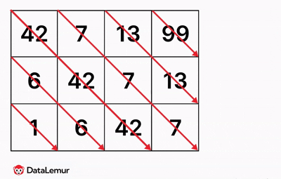
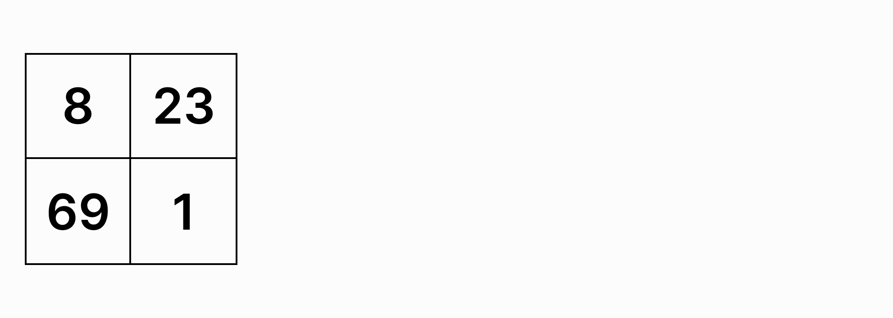

# Problem1: WeIrD StRiNg CaSe

Description:

Write a function that accepts a string, and returns the same string with all even indexed characters in each word upper cased, and all odd indexed characters in each word lower cased. The indexing just explained is zero based, so the zero-ith index is even, therefore that character should be upper cased and you need to start over for each word.

The passed in string will only consist of alphabetical characters and spaces(' '). Spaces will only be present if there are multiple words. Words will be separated by a single space(' ').
Examples:
```
"String" => "StRiNg"
"Weird string case" => "WeIrD StRiNg CaSe"
```

[WeIrD StRiNg CaSe solution](01.py) 


-------------------------------------------------

# Problem2: Job Matching #1

Description:

Let's build a matchmaking system that helps discover jobs for developers based on a number of factors.

One of the simplest, yet most important factors is compensation. As developers we know how much money we need to support our lifestyle, so we generally have a rough idea of the minimum salary we would be satisfied with.

Let's give this a try. We'll create a function match (job_matching in Python) which takes a candidate and a job, which will return a Boolean indicating whether the job is a valid match for the candidate.

A candidate will have a minimum salary, so it will look like this:
```
candidate = {
  'min_salary': 120000
}
```

A job will have a maximum salary, so it will look like this:
```
job = {
  'max_salary': 140000
}
```
If either the candidate's minimum salary or the job's maximum salary is not present, throw an error.

For a valid match, the candidate's minimum salary must be less than or equal to the job's maximum salary. However, let's also include 10% wiggle room (deducted from the candidate's minimum salary) in case the candidate is a rockstar who enjoys programming on Codewars in their spare time. The company offering the job may be able to work something out. 

[Job Matching #1 Solution](02.py)

--- 
# Problem3: Job Matching #2 
Description:

Consider a matchmaking system that is designed to deliver jobs to software developers on a continual basis. As more quality jobs are handpicked into the system, they will be matched to all the enrolled developers; affording them better opportunities daily.

This means that somewhere in the system there exists functionality to take a job and match it against enrolled candidates. There are several factors that go into this matching, but we'll focus on two for the purposes of this Kata.

Create a function match which takes a job, and filters a list of candidates to the ones that match the job. We'll focus on two matching properties for this Kata: equity and location.

Equity

The candidate has an equity property (boolean) indicating if they desire equity, while the job will have a maximum equity property (float) representing the max amount of equity offered. If the maximum equity is zero, we can infer there is no equity offered. A job will match unless the candidate desires equity, but the job does not offer any.

Location

The candidate will have two location properties: current location and desired locations. A job can be located in multiple places as well which will be represented by its locations property. A match is when a job location is either in the candidate's current location or any of the candidate's desired locations.

So the candidate list might look like this:

```
candidates = [{
  'desires_equity': True,
  'current_location': 'New York',
  'desired_locations': ['San Francisco', 'Los Angeles']
}, ...]
```

And a job might look like this:

```
job = {
  'equity_max': 1.2,
  'locations': ['New York', 'Kentucky']
}
```

[Job Matching #2 Solution](03.py)


---------

# Problem4: KISS - Keep It Simple Stupid

Description:

KISS stands for Keep It Simple Stupid. It is a design principle for keeping things simple rather than complex.

You are the boss of Joe.

Joe is submitting words to you to publish to a blog. He likes to complicate things.

Define a function that determines if Joe's work is simple or complex.

Input will be non emtpy strings with no punctuation.

It is simple if: the length of each word does not exceed the amount of words in the string (See example test cases)

Otherwise it is complex.
```
If complex:
return "Keep It Simple Stupid"
```
or 
```
if it was kept simple:
return "Good work Joe!"
```
[KISS - Keep It Simple Stupid Solution](04.py)


---------

# Problem5: Create Phone Number

Description:

Write a function that accepts an array of 10 integers (between 0 and 9), that returns a string of those numbers in the form of a phone number.
Example
```
create_phone_number([1, 2, 3, 4, 5, 6, 7, 8, 9, 0]) # => returns "(123) 456-7890"
```
The returned format must be correct in order to complete this challenge.

Don't forget the space after the closing parentheses!

[Create Phone Number Solution](05.py)

--- 
# Problem 6: Factorial Formula
Given a number nn, write a formula that returns n!n!.

In case you forgot the factorial formula, n!=n∗(n−1)∗(n−2)∗.....2∗1n!=n∗(n−1)∗(n−2)∗.....2∗1.

For example, 5!=5∗4∗3∗2∗1=120


Assume is nn is a non-negative integer.

[Factorial Formula Solution](06.py)


---- 
# Problem 7: Base 13 Conversion
Given an integer num, return its string representation in base 13.

In case you don’t use base 13 that much (who does, right?), here’s a quick rundown: just like base 10 uses digits from 0 to 9. But also for 10, 11 and 12, we use the letters A, B, and C.

For example:

    9 in base 13 is still "9"
    10 in base 13 is "A"
    11 in base 13 is "B"
    12 in base 13 is "C"
    13 in base 13 is "10"
    14 in base 13 is "11"
    49 in base 13 is "3A" (since 3∗13+10=493∗13+10=49)
    69 in base 13 is "54" (since 5∗13+4=695∗13+4=69)

Let's use 49 as an example and go through each step:

    Start with 49. Divide 49 by 13, which gives a quotient of 3 and a remainder of 10.

    Since the remainder 10 is greater than 9, it’s represented by the letter "A" in base 13.

    Now, update the number to be the quotient, which is 3, and repeat the process.

    Next, divide 3 by 13. The quotient is 0, and the remainder is 3.

[Base 13 conversion Solution](07.py)


---

# Problem 8: Same Stripes
You are given an m x n matrix. Your task is to determine if the matrix has diagonal stripes where all elements in each diagonal from top-left to bottom-right are of the same stripe—that is, they are identical.

In this context, each diagonal stripe runs from the top-left corner to the bottom-right corner of the matrix. Check if every diagonal stripe consists entirely of the same number.

Return True if all diagonal stripes are of the same stripe, otherwise return False.
Example #1



Same Stripe DataLemur Example 1

Input: matrix = [[42, 7, 13, 99], [6, 42, 7, 13], [1, 6, 42, 7]]

Output: True

Explanation:
In this grid, the diagonals are:

    [1]
    [6, 6]
    [42, 42, 42]
    [7, 7, 7]
    [13, 13]
    [99]

All elements in each diagonal ar identical. Thus, the answer is True.
Example #2 


Input: matrix = [[8, 23], [69, 1]]

Output: False

![Same Stripe DataLemur Example 2]

Explanation:
The diagonal [8, 1] does not consist of elements of the same stripe.

[Same stripes Solution](08.py)
-----

# Problem 9: Intersection of Two Lists
Write a function to get the intersection of two lists.

For example, 

if A = [1, 2, 3, 4, 5], and B = [0, 1, 3, 7] then you should return [1, 3].

[Intersection_of_two_lists_Solution](09.py)

--- 

# problem 10: 